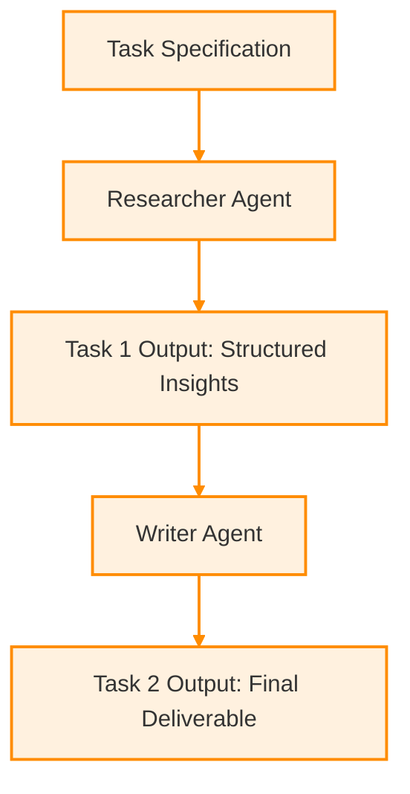
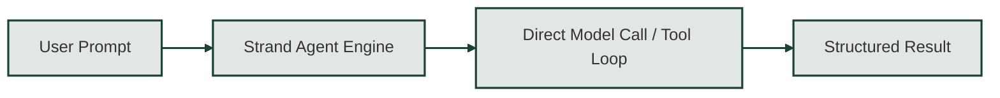
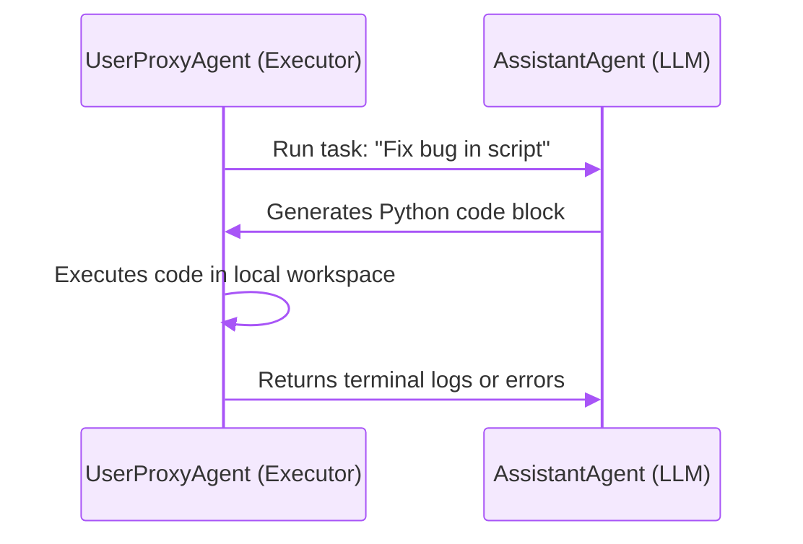
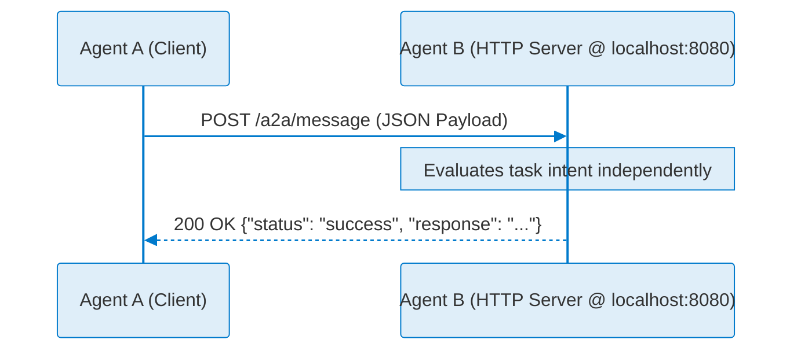

# Multi-Agent Frameworks & Protocols (`multi_agents/`)

This directory serves as a practical codebase comparing four distinct paradigms in multi-agent systems (MAS): **CrewAI**, **Strands**, **AG2 / AutoGen**, and the **Agent-to-Agent (A2A) Protocol**.

---

## Directory Structure
```
multi_agents/
├── A2A/
│   └── a2a_agent.py                      # Distributed HTTP/JSON-RPC protocol demo
├── autogen/
│   └── autogen_agent.py                  # Autonomous debugging loop (AG2 / AutoGen)
├── crewai/
│   ├── crewai_agent.py                   # Role-based task pipeline agent
│   └── trace.log.txt                     # Execution logs and verbosity trace
└── strands/
    ├── strand_agent.py                   # Model-driven workflow implementation
    └── strands_and_crewai_comparison.md # Comparative architectural breakdown
```
---

## Architecture Stack Breakdown

| Stack / Paradigm | Architectural Role | Execution Boundary | Core Mechanics |
| --- | --- | --- | --- |
| **CrewAI** | Role-Driven Task Orchestration | In-Process (Shared Memory) | Structured `Agent` and `Task` primitives bound to explicit process workflows. |
| **Strands** | Model-Driven Lightweight Orchestration | In-Process (Shared Memory) | Minimalist agent abstraction emphasizing direct model controls and flexible execution loops. |
| **AG2 / AutoGen** | Autonomous Multi-Turn Conversations | In-Process (Shared Memory) | Conversational agents (`AssistantAgent` + `UserProxyAgent`) communicating via automated reply loops and local code execution. |
| **A2A Protocol** | Cross-Network Agent Delegation | Microservices (HTTP / JSON) | Framework-agnostic protocol enabling distinct agents to communicate over web APIs without sharing code or state. |

---

## Module Overviews, Diagrams & Execution

### Prerequisites & Setup

Ensure environment variables are configured in your `.env` file at the root of the project:

```env
GEMINI_API_KEY=your_gemini_api_key_here

```

Execute scripts using Pixi to maintain isolated dependency resolution:

```bash
pixi run python <path_to_script>

```

---

### 1. CrewAI (`crewai/`)  &nbsp; 

* **File:** `crewai/crewai_agent.py`
* **Focus:** Demonstrates explicit role-playing, goal-oriented prompt structures, and task pipeline chaining. Output traces are logged locally to `trace.log.txt`.
* **Execution:**
```bash
pixi run python crewai/crewai_agent.py

```


#### Flow Diagram & Image Reference


---

### 2. Strands (`strands/`)  &nbsp; 

* **Files:** `strands/strand_agent.py`, `strands/strands_and_crewai_comparison.md`
* **Focus:** Minimalist model-driven control flow designed to reduce orchestration overhead compared to heavier role-driven frameworks.
* **Execution:**
```bash
pixi run python strands/strand_agent.py

```


#### Flow Diagram & Image Reference



---

### 3. AG2 / AutoGen (`autogen/`)  &nbsp; 

* **File:** `autogen/autogen_agent.py`
* **Focus:** Sets up an autonomous developer-executor conversation loop (`AssistantAgent` vs. `UserProxyAgent`). The assistant writes Python code, while the user proxy executes it locally and feeds back execution errors or terminal outputs until the task terminates.
* **Execution:**
```bash
pixi run python autogen/autogen_agent.py

```


#### Flow Diagram & Image Reference


---

### 4. A2A Protocol (`A2A/`)    &nbsp;

* **File:** `A2A/a2a_agent.py`
* **Focus:** Demonstrates distributed agent delegation over local HTTP endpoints (`localhost:8080`). Models how remote, opaque agents discover capabilities, delegate tasks, and exchange JSON payloads over standard network APIs.
* **Execution:**
```bash
pixi run python A2A/a2a_agent.py

```


#### Flow Diagram & Image Reference


---

## Core Paradigm Takeaways

* **Intra-App Frameworks (CrewAI, Strands, AutoGen):** Used to *build* the reasoning and execution logic of individual agent systems running on a single engine.
* **Inter-App Protocol (A2A):** Used to *connect* independent agents across different frameworks, servers, or cloud environments over network sockets.